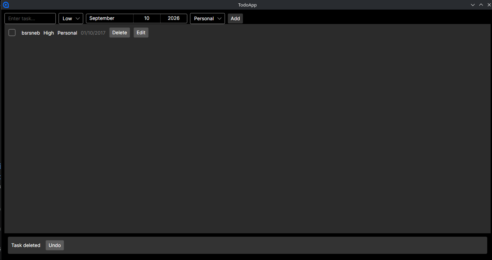
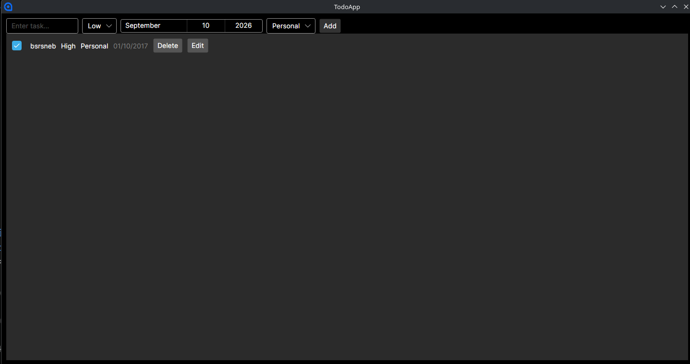
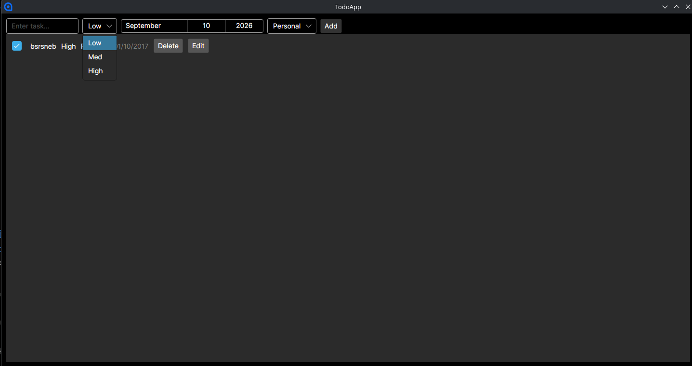
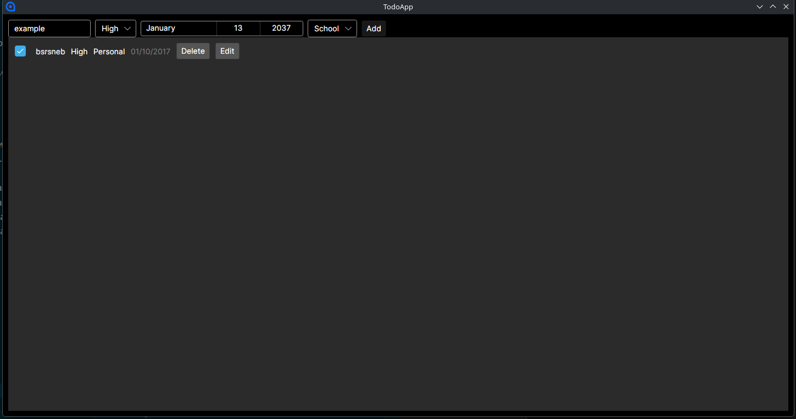
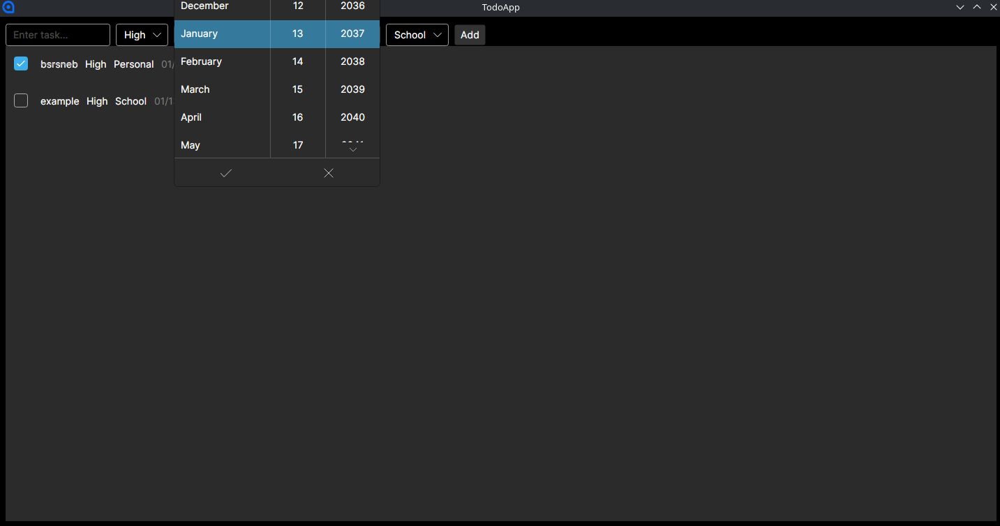

# CMSC 128 Lab 1 — To-Do List (CRUD)

A desktop To-Do List app built with **C# and Avalonia UI**, using **SQLite** for persistent storage.

## Tech Stack

- **UI Framework:** [Avalonia UI](https://avaloniaui.net/) (MVVM pattern) — a cross-platform .NET UI framework, chosen so the app runs natively on Linux without needing Windows-only tooling.
- **MVVM Toolkit:** [CommunityToolkit.Mvvm](https://learn.microsoft.com/en-us/dotnet/communitytoolkit/mvvm/) — provides `[ObservableProperty]` and `[RelayCommand]` source generators to cut down on MVVM boilerplate.
- **Database:** SQLite, accessed through **Entity Framework Core** (`Microsoft.EntityFrameworkCore.Sqlite`).
  - Chosen because it's a single-file, zero-configuration database — appropriate for a small single-user to-do list, with no server setup required. The database file (`todos.db`) sits next to the app and persists automatically across restarts.
  - The schema is created automatically on first run via `EnsureCreated()` in the `TodoDbContext` — no manual migration step is needed to get started.

## Features Implemented

- Add / Edit / Delete / Mark-done tasks (Title, Due Date, Priority, Tag)
- Delete requires confirmation via a custom dialog window
- **Undo on Delete** — deleting a task shows an undo option for a few seconds before it's permanently removed from the database
- **Calendar View** — see which dates have tasks due, and manage tasks for a selected day

## How to Run Locally

### Prerequisites
- [.NET SDK](https://dotnet.microsoft.com/download) (latest version)
- Linux, Windows, or macOS

### Setup

```bash
# clone the repo
git clone https://github.com/pojomo2/cmsc128-Lab1_CRUD_Cudiamat.git
cd cmsc128-Lab1_CRUD_Cudiamat/TodoApp

# restore dependencies
dotnet restore

# run the app
dotnet run
```

No manual database setup is required — the SQLite database (`todos.db`) is created automatically in the project folder the first time the app runs.

### Troubleshooting (Linux)
If the window doesn't render correctly on some distros, try forcing software rendering:
```bash
dotnet run -- --avalonia-render-backend=software
```

## Data Operations (CRUD)

This app doesn't expose REST endpoints — CRUD operations happen directly against the local SQLite database via Entity Framework Core, called from the `MainWindowViewModel`. Rough equivalents:

| Operation | Where it happens | What it does |
|---|---|---|
| **Create** | `AddTask()` in `MainWindowViewModel.cs` | Builds a new `TodoItem`, adds it to `_db.Tasks`, calls `_db.SaveChanges()` to write it to `todos.db` |
| **Read** | `Load()` in `MainWindowViewModel.cs` | Queries `_db.Tasks.OrderBy(...)` on startup and populates the on-screen `ObservableCollection<TodoItem>` |
| **Update** | `ToggleDone()` in `MainWindowViewModel.cs` | Flips `IsDone` on an existing tracked `TodoItem`, then `_db.SaveChanges()` persists the change |
| **Delete** | `DeleteTask()` in `MainWindowViewModel.cs` | Shows a confirmation dialog; on confirm, removes the task from the UI list and starts a 5-second undo timer before actually removing it from `_db` via `_db.SaveChanges()` |

## Project Structure

```
TodoApp/
├── Models/
│   └── TodoItem.cs           # data model — one task record
├── Data/
│   └── TodoDbContext.cs      # EF Core context — persistence layer (SQLite)
├── Converters/
│   └── StrikethroughConverter.cs  # bool -> TextDecorations for marking done tasks
├── ViewModels/
│   ├── ViewModelBase.cs
│   └── MainWindowViewModel.cs # CRUD logic, commands, undo timer
├── Views/
│   ├── MainWindow.axaml       # main UI (task list + add form)
│   ├── MainWindow.axaml.cs
│   ├── ConfirmDialog.axaml    # delete confirmation dialog
│   └── ConfirmDialog.axaml.cs
├── App.axaml.cs
└── Program.cs
```

## Screenshots


|  |  |  |

|  |  |